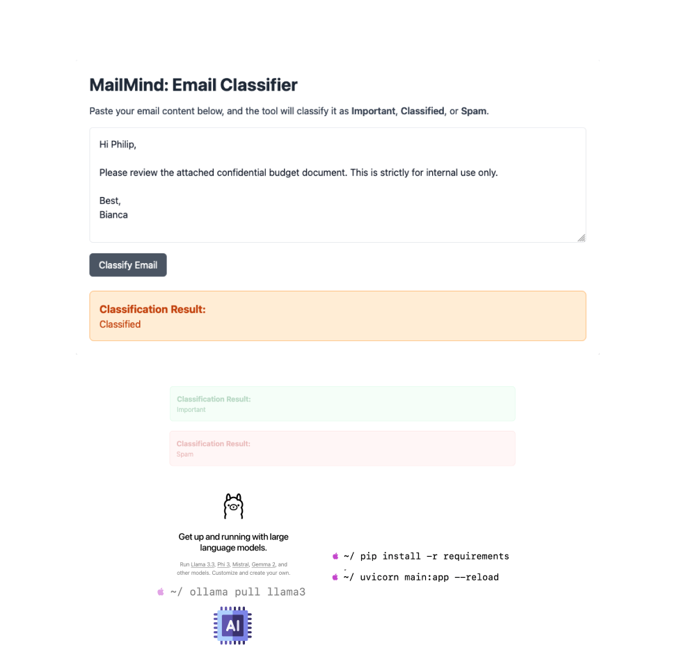

# Getting Started with LLMs: Email Classifier



This basic project provides a simple and practical example of using Large Language Models (LLMs) like Llama 3 to build an AI-powered email classifier. It's a great starting point for students to understand how to leverage LLMs and develop their own AI agents or assistants.

> ## Next Steps for Students 
> You can extend this project into a powerful AI Office Assistant by integrating:
> 1. **Mail Clients**: Connect to Gmail, Outlook, or other clients to classify emails e.g. Work, Important, Urgent, Classified, Spams. 
> 2. **Calendars**: Automate scheduling, meeting reminders, and event creation. 
> 3. **To-Do Lists**: Extract tasks from emails and add them to tools like Todoist or Microsoft To-Do. 
> 4. **Reminders**: Automatically generate and send reminders for tasks, meetings, or deadlines.
> ### Example Ideas:
> - Automatically summarize emails and schedule meetings based on their content. 
> - Build a task tracker that identifies action items and syncs them to calendars or to-do lists. 
> - Integrate messaging apps (like Slack or Teams) for notifications.

## Features
- Classifies emails into `Important`, `Classified`, or `Spam`.
- Built using [FastAPI](https://fastapi.tiangolo.com/) for backend and `Jinja2` for frontend templates. 
- Runs `LLMs` locally with [Ollama](https://ollama.com) or integrates with [GROQ](https://groq.com/) for faster inference. 
- Styled with [Tailwind CSS](https://tailwindui.com/) for a modern, responsive UI.
## Getting Started
- Install required Python libraries:
    ```bash
    pip install fastapi uvicorn requests jinja2 python-multipart
    ```
- Install **Ollama** from [https://ollama.ai](https://ollama.ai)
- Pull the Llama Model
    ```bash
    ollama pull llama3
    ```
## Run the App
- Clone this repository
- Start the FastAPI server:
    ```bash
    uvicorn main:app --reload
    ```
- Open you browser and visit: http://127.0.0.1:8000

## Contributing
Students are encouraged to fork this project, add their features, and share improvements via pull requests. Let’s build smarter AI tools together!